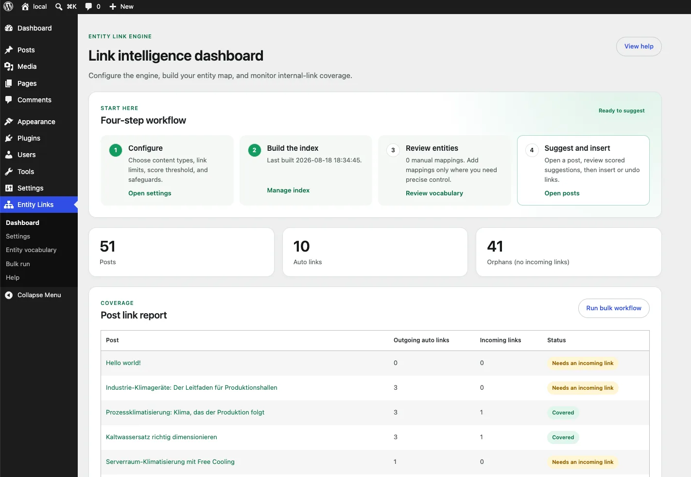
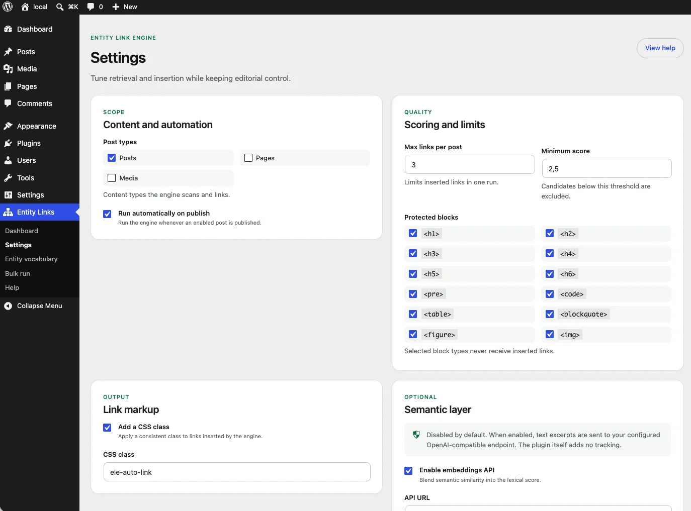
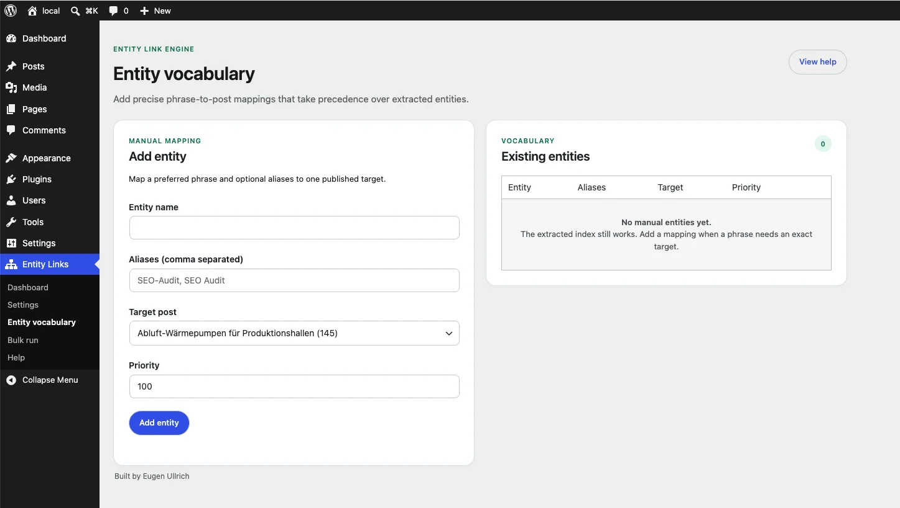
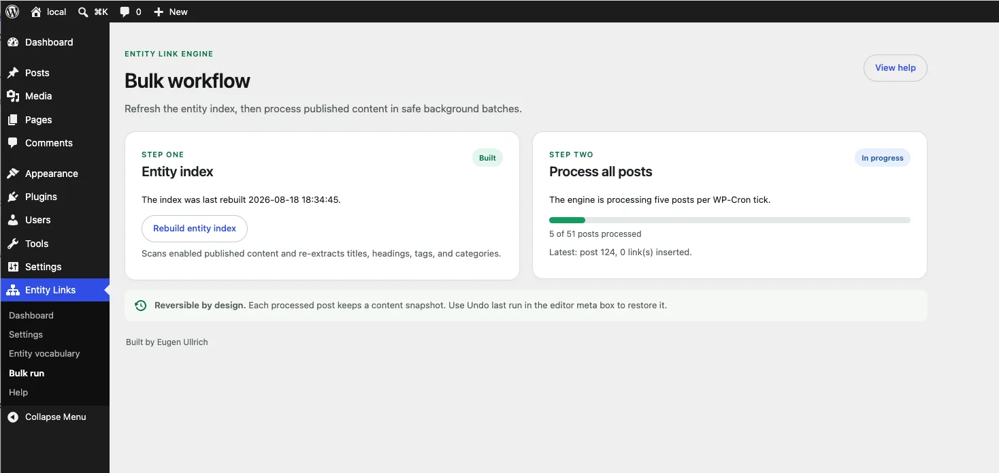
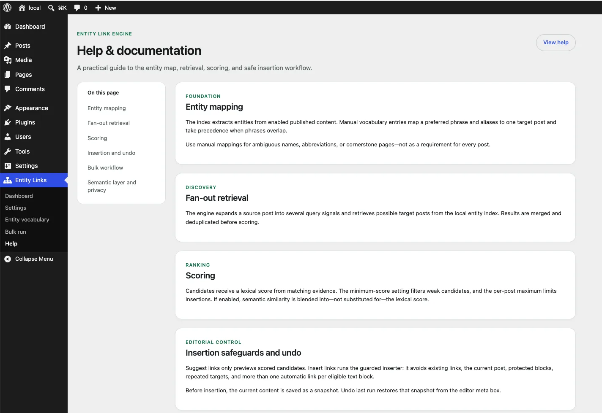

# Entity Link Engine

**Automatic internal linking for WordPress — with entity mapping, fan-out
retrieval queries and explainable, score-ranked links. Not random links.**

[](LICENSE)

Entity Link Engine builds your site's internal link structure the way a
retrieval system would: it maps the **entities** in your content to the posts
that answer them, expands every post into **fan-out queries**, scores the
retrieved candidates, and only then inserts internal links.

```text
Post content
   │  1. Entity mapping  → controlled vocabulary + auto-extracted entities
   ▼
Fan-out queries  → title, headings, entities, taxonomies, n-grams
   │  2. Retrieval  → candidates from the entity index
   ▼
Scoring  → taxonomy, terms, entity overlap, fan-out coverage, editorial links
   │  3. Score ≥ 2.5 → top 3 candidates
   ▼
Insertion  → word boundaries, no headings/code/tables, one link per paragraph
```

## Download

The ready-to-install plugin ZIP is attached to every
[GitHub Release](https://github.com/eullr/entity-link-engine/releases/latest)
(`entity-link-engine.zip`). Install it under
`/wp-content/plugins/entity-link-engine/` and activate it in WordPress.

## Screenshots

| | |
|---|---|
|  |  |
|  |  |
|  | |

The dashboard leads through a four-step workflow (configure → build index →
review entities → suggest in the editor), the settings stay grouped and
readable, and the integrated help explains mapping, retrieval, scoring and
the undo workflow on one page.

## Why not just a keyword list?

A keyword list finds a phrase. It doesn't know whether the link makes sense.
Entity Link Engine blocks the classic mistakes **before** insertion:

- never inside headings, code, `pre`, tables, blockquotes, figures or images;
- never inside a word or an existing link (no "audit" inside "GEO-Audit");
- at most one auto link per paragraph, three per post by default;
- each target URL at most once;
- existing editorial links are never modified.

No candidate above the score threshold? The plugin inserts nothing. An empty
suggestion is better than a weak link.

## Features

- **Entity mapping** — controlled vocabulary (phrase + aliases + target) plus
  auto-extraction from titles, headings, tags and categories.
- **Fan-out retrieval** — one post becomes many queries; a candidate gains
  score when several query types lead to the same target.
- **Explainable scoring** — every suggestion shows its score and the reasons
  behind it (shared tags, term overlap, fan-out coverage, link signals).
- **Preview → apply → undo** — editor meta box suggests, you approve; a
  snapshot restores the exact previous content.
- **Onboarding dashboard** — a four-step workflow that shows exactly where
  you are: settings, index, vocabulary, editor.
- **Bulk run** — process all posts via WP-Cron batches.
- **Link report** — dashboard with outgoing/incoming links and orphans.
- **Integrated help** — documentation for mapping, retrieval, scoring,
  insertion safeguards, undo, bulk workflow and privacy.
- **Optional semantic layer** — opt-in embeddings via any OpenAI-compatible
  endpoint; disabled by default, fully local otherwise.
- **Local by default** — no external service, no account, no data leaves the
  site unless you enable the semantic layer.

## Requirements

- WordPress 6.0+
- PHP 7.4+

## Installation

1. Download `entity-link-engine.zip` from the
   [latest release](https://github.com/eullr/entity-link-engine/releases/latest),
   or copy this repository's plugin files into
   `/wp-content/plugins/entity-link-engine/`.
2. Activate the plugin.
3. Go to **Entity Links → Bulk run** and click **Rebuild entity index**.
4. Optionally add manual entities under **Entity Links → Entity vocabulary**.
5. Open a post — the *Entity Link Engine* meta box previews suggestions.

## Documentation

- [English documentation](docs/documentation-en.md)
- [Deutsche Dokumentation](docs/documentation-de.md)
- [WordPress.org readme](readme.txt)

## Demo content

`demo/` contains a German demo dataset (50 blog posts + 20 pages, topic:
*Industrie-Klimageräte*) as a WXR import file plus 28 manual entities:

```bash
wp import demo/demo-content.xml --authors=create
wp eval-file demo/demo-entities.php
```

All figures in the demo content are fictional.

## Testing

The plugin is verified against a local WordPress 7.0.4 (SQLite) install:

- `tests/test-engine.php` — 30 functional checks (mapping, scoring, insertion,
  undo, auto-run, report)
- `tests/test-admin.php` — 27 admin/REST/UX checks (screens, settings,
  sanitization, onboarding, help, author attribution)

```bash
wp eval-file tests/test-engine.php
wp eval-file tests/test-admin.php
```

Official [Plugin Check](https://wordpress.org/plugins/plugin-check/):
**"No errors found."**

## Repository layout

| Path | Purpose |
|---|---|
| `entity-link-engine.php`, `includes/`, `assets/admin.*`, `readme.txt`, `uninstall.php` | Plugin code (the WP.org zip = exactly these files) |
| `assets/screenshots/` | Admin screenshots (WebP) |
| `docs/` | Documentation (EN + DE) |
| `demo/` | Demo content + entity importer |
| `tests/` | Functional + admin test suites |
| `tools/` | Asset generator (GD) |
| `wp-assets/` | Directory assets (banner/icon) for the WP.org SVN `assets/` folder |

## License

[GPLv2 or later](LICENSE) · © [Eugen Ullrich](https://eullrich.com)
